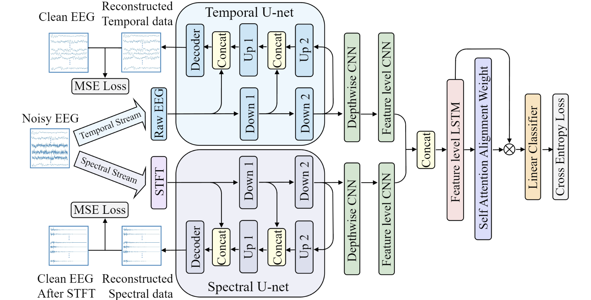

# TS-STDN (ICONIP 2023)



This is the official repository of our paper for ICONIP 23: [Two-Stream Spectral-Temporal Denoising Network for End-to-End Robust EEG-Based Emotion Recognition](https://link.springer.com/chapter/10.1007/978-981-99-8067-3_14).

- **Abstraction**: Emotion recognition based on electroencephalography (EEG) is attracting more and more interest in affective computing. Previous studies have predominantly relied on manually extracted features from EEG signals. It remains largely unexplored in the utilization of raw EEG signals, which contain more temporal information but present a significant challenge due to their abundance of redundant data and susceptibility to contamination from other physiological signals, such as electrooculography (EOG) and electromyography (EMG). To cope with the high dimensionality and noise interference in end-to-end EEG-based emotion recognition tasks, we introduce a Two-Stream Spectral-Temporal Denois- ing Network (TS-STDN) which takes into account the spectral and temporal aspects of EEG signals. Moreover, two U-net modules are adopted to reconstruct clean EEG signals in both spectral and temporal domains while extracting discriminative features from noisy data for classifying emotions. Extensive experiments are conducted on two public datasets, SEED and SEED-IV, with the original EEG signals and the noisy EEG signals contaminated by EMG signals. Compared to the baselines, our TS-STDN model exhibits a notable improvement in accuracy, demonstrating an increase of 6% and 8% on the clean data and 11% and 10% on the noisy data, which shows the robustness of the model.

The source code of the TS-STDN model and producing noisy data.

## Example
Example code for the use of TS-STDN:
```python
import torch
from torch import nn

model = TS_STDN(classes_num=3, C=62, T=400, D=4, d=16, Fs=16, Ft=16)
x = torch.rand(size=(1, 1, 62, 400))
print(x.shape)
y, recons_t, recons_s = model(x)
print(y.shape, recons_t.shape, recons_s.shape)
```

Example code for training TS-STDN:
```python
import torch
import torch.nn.functional as F
from models import TS_STDN
from sklearn.metrics import accuracy_score

def torch_stft(self, X_train):
    signal = []
    # index = np.arange(X_train.shape[1])
    # np.random.shuffle(index)
    for s in range(X_train.shape[1]):
        spectral = torch.stft(X_train[:, s, :],
            n_fft = 200,
            hop_length = 200,
            center = False,
            onesided = True)
        signal.append(spectral)
    
    signal1 = torch.stack(signal)[:, :, :, :, 0].permute(1, 0, 2, 3)
    signal2 = torch.stack(signal)[:, :, :, :, 1].permute(1, 0, 2, 3)

    return torch.cat([torch.log(torch.abs(signal1) + 1e-8), torch.log(torch.abs(signal2) + 1e-8)], dim=2)

def train(optimizer, train_dataloader, local_rank, epochs):
    model = TS_STDN(classes_num=3, C=62, T=400, D=4, d=16, Fs=16, Ft=16)
    for epoch in range(epochs):
        model.train()
        loss_all = 0
        preds = []
        labels = []
        
        # eeg: clean EEG, bad_eeg: EEG contaminated by noise, label: class label
        for eeg, bad_eeg, label in train_dataloader:
            label = label.to(local_rank, non_blocking=True)
            eeg = eeg.to(local_rank, non_blocking=True)
            bad_eeg = bad_eeg.to(local_rank, non_blocking=True)
            eeg_s = torch_stft(eeg.reshape(eeg.shape[0], eeg.shape[2], eeg.shape[3]))
            y, recons_t, recons_s = model(bad_eeg)
            loss_ce = F.cross_entropy(input=y, target=label.long())
            loss_recon = F.mse_loss(recons_t, eeg) + F.mse_loss(recons_s, eeg_s)
            loss = loss_ce + loss_recon
            loss_all += loss.item()
            
            optimizer.zero_grad()
            loss.backward()
            optimizer.step()
            preds.append(torch.argmax(y, dim=-1).cpu())
            labels.append(label.cpu())

        pred = torch.cat(preds, dim=0)
        label = torch.cat(labels, dim=0)
        train_accuracy = accuracy_score(label, pred)
```

## Citation
If you find our paper/code/dataset useful, please consider citing our work:
```
@inproceedings{liu2023two,
  title={Two-Stream Spectral-Temporal Denoising Network for End-to-End Robust EEG-Based Emotion Recognition},
  author={Liu, Xuan-Hao and Jiang, Wei-Bang and Zheng, Wei-Long and Lu, Bao-Liang},
  booktitle={International Conference on Neural Information Processing},
  pages={186--197},
  year={2023},
  organization={Springer}
}
```
